---

---

# 			C++程序设计实验报告

项目名称：基于c++的贪吃蛇游戏

姓名：杨丰源	学号：2023110148	学院：信通院	

[TOC]

## 实验目的

使用c++语言编写一个贪吃蛇游戏，旨在提供一个基于控制台的交互式游戏体验，展示经典贪吃蛇游戏的玩法和乐趣。

## 实验内容

在控制台界面实现一个经典贪吃蛇游戏，包括蛇的移动、食物生成、得分计算、排行榜等基本功能。

## 环境配置

Visual studio 2022

## 总体设计

1. 整体设计

​	游戏分为两层循环，外层循环负责选择难度、绘制界面、开启游戏，内层循环为游戏内容循环。

2. 交互界面设计

- 开始界面

  - 触发：程序一旦运行就先触发开始界面。

  - 绘制窗口：首先绘制41\*32大小的窗口，游戏开始后，左侧中间30\*30用于游戏界面，右侧区域用于侧边栏。

  - 开场动画：从左往右蜿蜒爬行的蛇、“GREEDY SNAKE”文字

  - 操作提示：下方“按回车键开始游戏”提示，将光标移到(0,0)，等待用户按下回车来结束这部分。

  - 选择难度：删除“按回车键开始游戏”提示，下方空间左侧显示“选择游戏难度”和操作提示，右侧显示“简单/普通/困难/炼狱模式”分别对应不同刷新时间，刷新越快蛇移速越快，对应难度等级越高。

  - 结束：选择好难度就结束。

  开屏动画：

  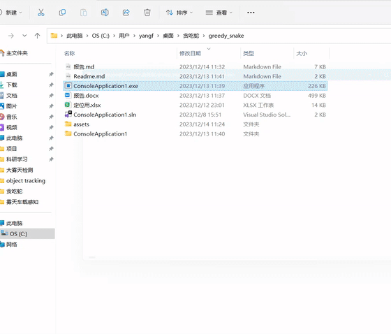

选择难度：

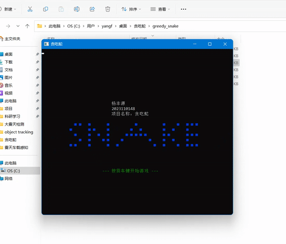

- 地图绘制界面

  - 触发：选择完难度，自动进入绘制模块。
  - 清屏：清空界面信息，防止干扰。
  - 绘制地图：在41\*32窗口左侧绘制30\*30游戏框，第0和31行空出来。
  - 绘制侧边栏：选择合适的位置打印基本信息、得分、操作提示。
  - 结束：绘制完就结束。

  绘制地图：

  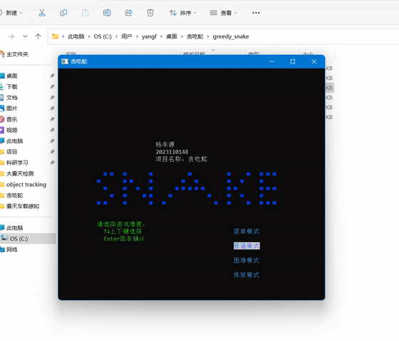

  

- 结束界面

  - 触发：当蛇撞到边界或咬到自己时或强行停止时触发。
  - 弹窗提示：覆盖游戏区中心区域，显示游戏结束提示、最终分数、是否重开和成绩是否计入排行榜选项。
  - 结束：在重开选项选择确认或拒绝，结束该界面；选择"计入排行榜"将触发清屏并进入信息输入界面。

  结束界面：

  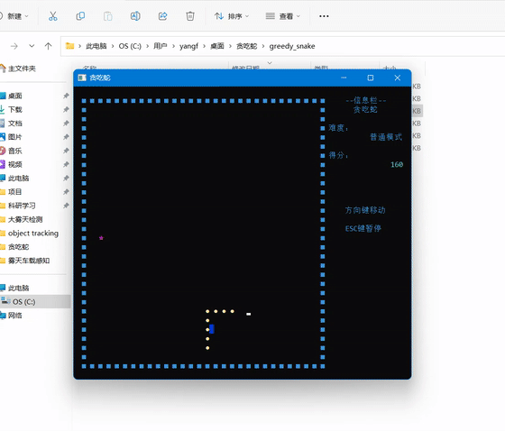

- 暂停界面

  - 触发：游戏开始后且未触发结束时，按ESC键触发暂停界面。
  - 绘制菜单：在侧边栏绘制暂停菜单，可选“继续/重开/退出”选项。
  - 结束：选择“继续”，擦除菜单，继续游戏；选择“重开”，清屏，返回开始界面；选择“退出”，擦除菜单，回到游戏，然后自动触发结束界面。

- 信息输入界面

  - 触发：结束界面选择“成绩计入排行榜”	
  - 绘制界面：生成一个提示框，里面打印了此次成绩，需要键入玩家姓名，要求不超过8个字符长度，且为数字与字母组合。
  - 结束：输入姓名符合要求，回车退出此界面。

- 排行榜界面

  - 触发：信息输入界面关闭。

  - 绘制界面：清屏，绘制排行榜，打印前8名排行-姓名-成绩，打印玩家最高排名成绩。

  - 结束：按回车退出界面，回到结束界面。

    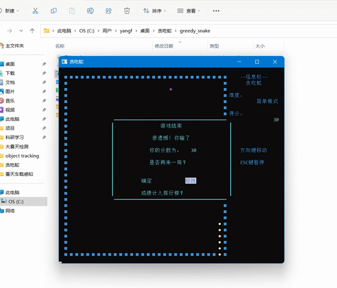

3. 游戏内容设计

- 主函数

  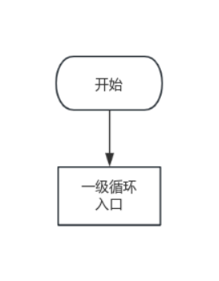

- 一级循环

  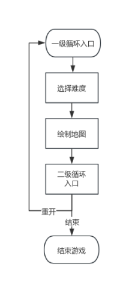

- 二级循环

  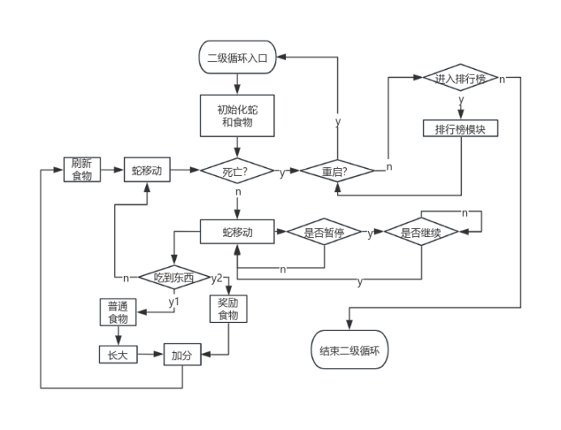

- 排行榜

  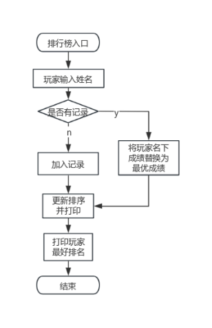

## 功能模块

1. 与蛇相关模块

​	(1) 初试化

​	在30*30框中间(14,8)(15,8)(16,8)生成蛇的身体，运动方向向下。

​	(2) 运动方向/增长

​	上下左右，朝哪个方向运动，就将蛇头对应方向上的点替换为新蛇头，增长一格。

​	(3) 运动

​	确定运动方向后，蛇头更新，蛇尾去掉一点长度。

​	(4) 变向

​	检测输入为上下左右后，改变运动方向。

​	【改】发现如果改变前后方向相反，改变后如果蛇身弯曲，新蛇头方向会与身体重合，导致崩溃。因此，规定改变的方向不能与原方向相反。

​	(5) 撞边界

​	当蛇头坐标x和y有一个超出[2,29]范围,就判定为超出边界。

​	(6) 咬到自己

​	遍历比较蛇身所有点，坐标重复即咬到自己。

​	【改】该方法随蛇变长，计算量太大，时间复杂度O(n(n-1)/2)。改为比较蛇头坐标与其他点坐标。时间复杂度降到O(n)。

​	(7) 吃到食物

​	蛇头坐标与食物坐标相同，标记为真。

​	(8) 吃到奖励

​	蛇头坐标与奖励坐标相同，标记为真。

2. 与食物相关

​	(1) 生成食物

​	在边界内并且非蛇身区域随机生成食物。

​	(2) 生成奖励

​	在边界内、非蛇身区域、非食物区域生成奖励，并且在第0行生成计时进度条，时间到未吃到的奖励消失。

​	(3) 计数

​	蛇每吃一个食物计数加一，逢五生成奖励食物。

​	(4) 奖励闪光

​	生成的奖励图标随刷新间隔出现，产生闪烁效果。

​	(5) 输出信息

​	输出是否吃到食物，是否吃到奖励，奖励剩余时间。 

3. 规则相关

​	(1) 打印字符

​	(2) 清除

​	(3) 修改坐标

​	(4) 更新分数

​	(5) 打印分数

4. 界面相关

​	(1) 设置窗口尺寸

​	(2) 设置文本颜色

​	(3) 设置背景颜色

​	(4) 设置光标位置

​	(5) 初试化地图

​	【改】将地图部分独立出来，方便改变地图布局（实现）。可以在选择难度后随机加载一种地图，增加游戏性。

​	(6) 打印分数

​	(7) 打印菜单

​	(8) 打印开始界面

​	(9) 打印暂停界面

​	(10) 打印结束界面

5. 游戏难度设计

​	不同游戏难度对应不同的打印时间间隔。时间间隔越短，刷新越快，蛇移动速度越快。所得分数倍率与速度正相关。

​	【改】分数结算方式改为不同难度对应不同倍率。特殊奖励分数与剩余时间正比。

6. 排行榜设计

​	(1) 游戏结束选择“成绩录入排行榜”后弹窗

​	(2) 输入玩家名字，匹配此次游戏得分。

​	(3) 同一用户更新为最好成绩再排名。

​	(4) 打印排行榜框。

​	(5) 游戏排行榜输出前8名（可更改）：排名-用户名-得分。

​	(6) 输出本玩家最好成绩排名。

## 效果演示

<video src="报告.assets/游戏录屏.mp4"></video>

开始界面：

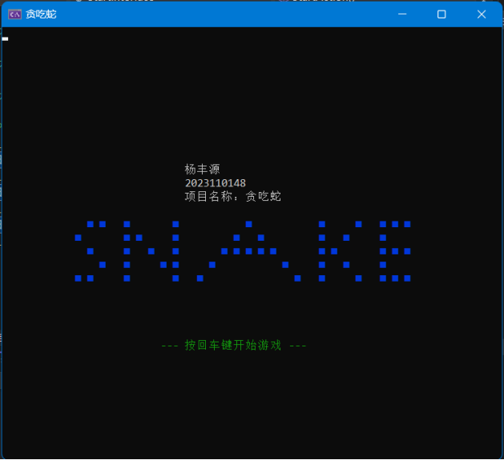

选择难度：

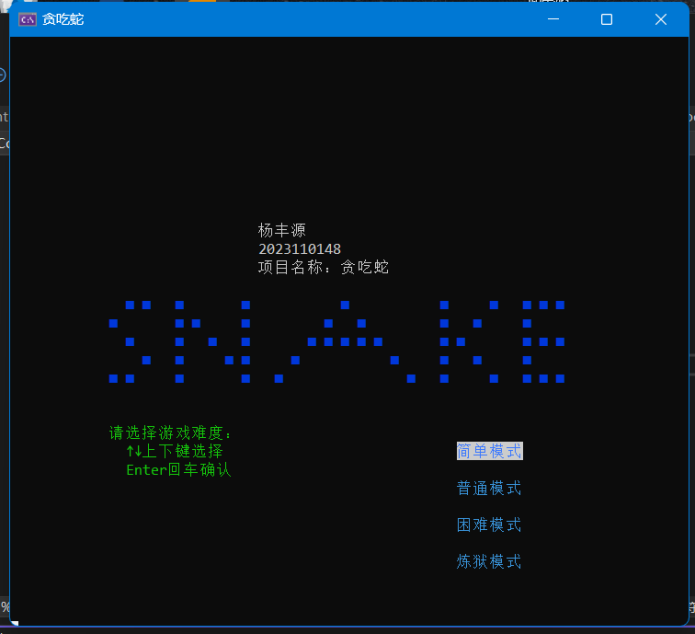

生成地图并开始游戏：

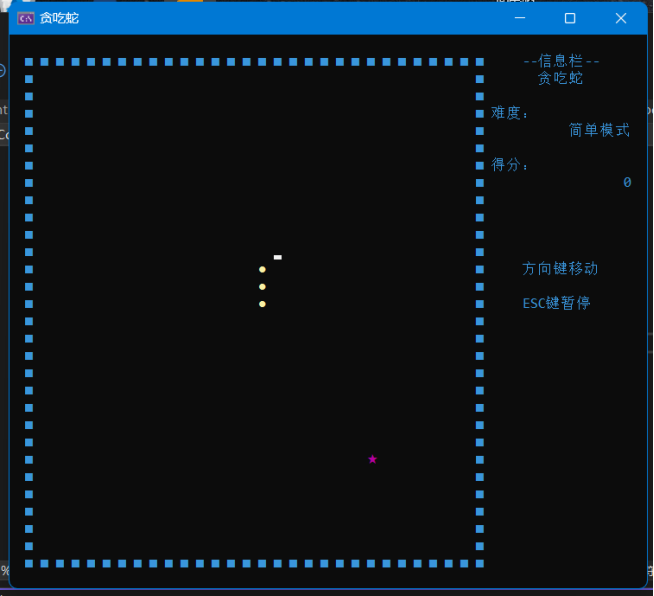

暂停界面：

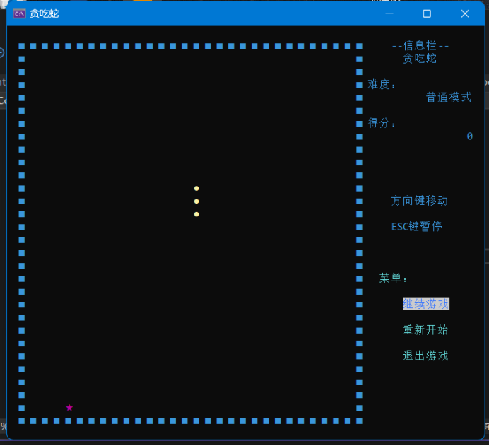

生成食物和奖励：

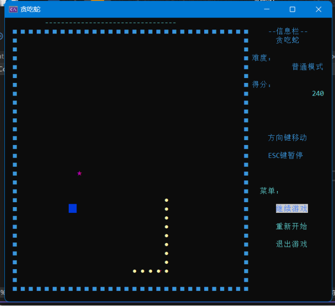

游戏失败界面：

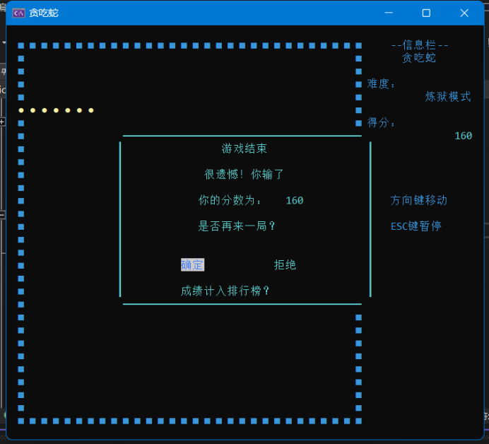

选择成绩计入排行榜后输入信息：

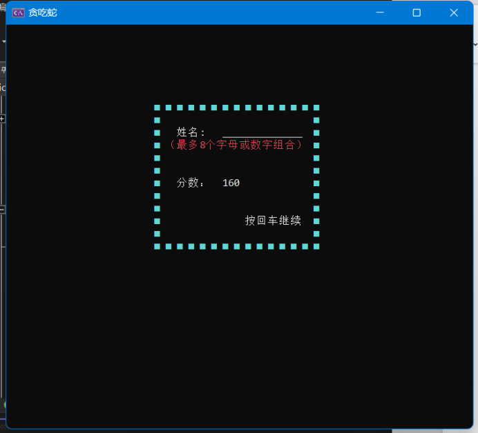

排行榜：

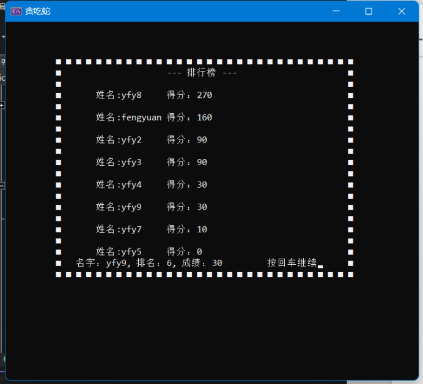

返回后选择重开界面：

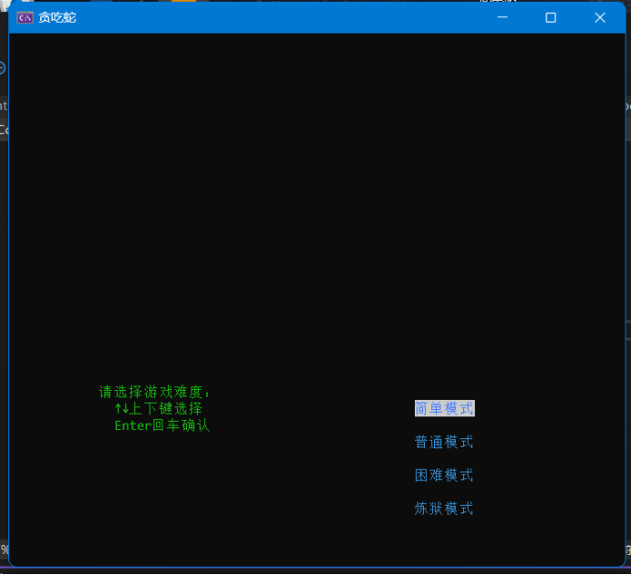

## GitHub链接

我将所有版本的代码全部上传到 Github中了，链接：https://github.com/yangfengyuan1/greedy_snake.git
